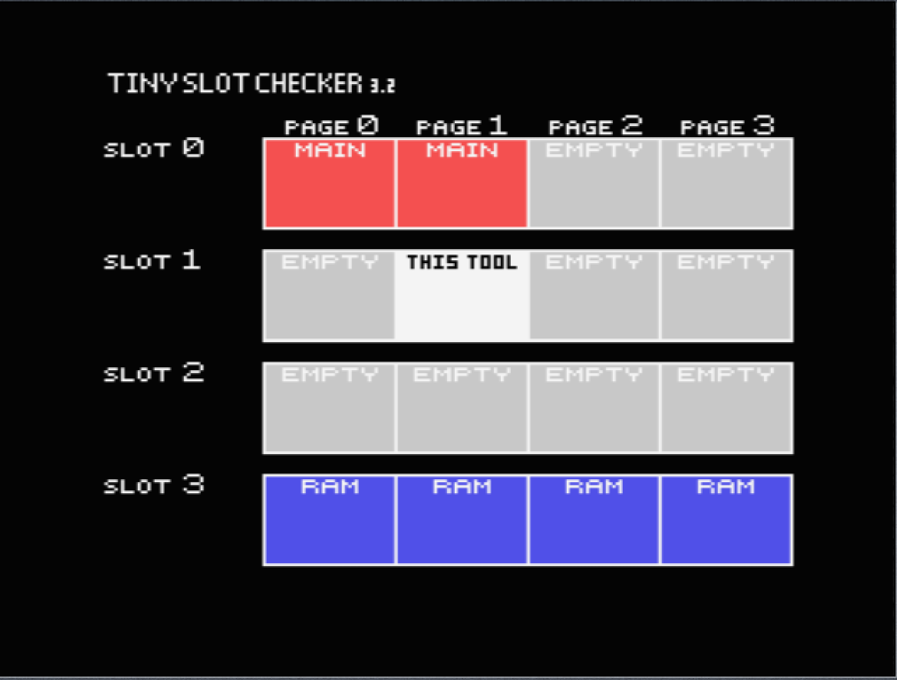

## 1.1 에뮬레이터

### 에뮬레이터 리스트

* [BlueMSX](http://bluemsx.msxblue.com/download.html)
* [WebMSX](https://webmsx.org/)
* [openMSX](https://openmsx.org/)
* [fMSX](https://fms.komkon.org/fMSX/)

### MSX 게임 플레이 해보기

* [파일헌터](https://www.file-hunter.com/MSX)
* [JAMSX](http://www.jamsx.com)

## 슬롯 시스템

슬롯slot은 메모리를 확장하는 시스템이며 슬롯에 있는 메모리를 16 KB 페이지 단위로    
CPU로 라우팅할 수 있다.    
Z80은 최대 64 KB까지만 주소를 지정할 수 있기 때문에 초과 공간에 접근하고 싶다면   
슬롯의 페이지 시스템을 활용해서 특정 페이지로 라우팅해야 하는 것이다. 
페이지의 크기는 16 KB이므로 하나의 슬롯에는 4개의 페이지가 존재한다. 

슬롯은 램, 롬, 그리고 다른 장치로 구성된다. 
슬롯과 페이지의 개념을 정확하게 이해하려면   
타이니 슬롯 체커Tiny Slot Checker라는 프로그램을 사용해서 슬롯을 확인해볼 수 있다. 
다음 그림은 C-BIOS MSX1 시스템에서 첫 번째 롬 카트리지에 1

6 KB 타이니 슬롯 체커 롬팩을 꼽은 뒤 실행한 화면이다. 

SLOT 0는 바이오스나 베이직 프로그램을 포함한 시스템 슬롯이다. 
SLOT 1과 SLOT 2는 롬팩을 꽂을 수 있는 카트리지를 의미하며 SLOT 3는 메인 램에 해당한다. 
각각의 슬롯은 64 KB 크기며 네 개의 페이지로 구성되어 있다. 

타이니 슬롯 체커 프로그램이 실행되면 SLOT 0의 PAGE 0과 1, 

SLOT 1의 PAGE 1, SLOT 3의 페이지 중 하나가 CPU 주소 라인에 매핑이 되어 64 KB를 구성한다. 
즉 SLOT 3의 나머지 페이지는 가용 램이지만 사용할 수 없는 상황인 것이다. 
이 SLOT 3의 나머지 페이지를 활용하려면 슬롯에 특정 명령을 내려 

접근하려는 페이지를 변경하면 된다. 
슬롯의 기본 크기는 64 KB이지만 기본 슬롯과 보조 슬롯을 결합한 형식을 사용하면 

슬롯을 16개까지 확장할 수 있게 되어 256 KB까지 공간을 확보할 수 있다. 
슬롯 접근을 통한 메모리 확장 이외에 메모리 매퍼를 통해서도 메모리 확장이 가능하다. 
메모리 매퍼에 대한 설명은 생략한다. 기본적으로 MSX1은 메모리 매퍼를 지원하지 않는다.

슬롯 프로그래밍과 메모리 매퍼를 활용해서 
64 KB 메모리 크기 제약 문제를 해결했지만 시스템이 제공하는 메인 램 자체가 부족한 문제도 해결해야 할 이슈였다.
이 부분은 여러 가지 방법으로 해결을 했었다. 예를 들어 MSX1 초기 모델의 경우 메인 램의 크기가 8 KB나 16 KB인 기종이 존재했는데 
이런 기종들은 시스템 본체 자체를 개조해서 기본 램을 증설했다.
다른 방법으로는 롬팩 카트리지가 두 개라는 것에 착안해서 하나의 카트리지는 
게임 롬팩으로 활용하고 나머지 카트리지에는 램팩을 꼽아서 기본 램을 증설하기도 했다.
일반적으로는 후자의 방법을 이용해서 기본 램을 메모리를 증설했다.

### 레퍼런스

* [Tiny Slot Checker](https://msxhub.com/TNSLCK)  
* [MSX 슬롯 프로그래밍](https://www.msx.org/wiki/Slots)   
