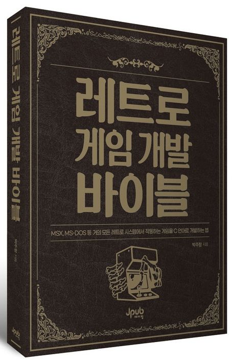

## 레트로 게임 개발 바이블  

"레트로 게임 개발 바이블" 서적을 학습하시는데 도움이 될 수 있도록 마련한 참조 페이지입니다.   
책에서 언급한 참조페이지는 각 챕터의 참조 페이지를 확인하시면 내용을 확인하실 수 있습니다.   
또한 공유 폴더에는 책에서 언급한 각종 툴과 데모 프로젝트가 존재합니다.     
인터넷의 특성상 기존에 존재했던 파일 다운로드 링크는 사라질 가능성이 있으니 그런 경우에는   
공유 폴더에서 필요 파일을 찾아 보시면 되겠습니다.   

* [예스24](http://www.yes24.com/Product/Goods/116258578)   
* [교보문고](https://product.kyobobook.co.kr/detail/S000200473470)   
* [알라딘](https://www.aladin.co.kr/shop/wproduct.aspx?ISBN=K202830147&start=pnaver_02)   

## 공유 폴더
[공유 폴더 2](http://naver.me/G3KwrLSz)  

## 참조 페이지 
* Chapter 01 - [MSX 플랫폼과 친해지기](https://github.com/pdpdds/retrogamedev/tree/main/Chapter01)  
* Chapter 02 - [개발 환경 구축](https://github.com/pdpdds/retrogamedev/tree/main/Chapter02)
* Chapter 03 - [기초 다지기](https://github.com/pdpdds/retrogamedev/tree/main/Chapter03)
* Chapter 04 - [샘플 게임 프로젝트](https://github.com/pdpdds/retrogamedev/tree/main/Chapter04)
* Chapter 05 - [GREEN 프로젝트](https://github.com/pdpdds/retrogamedev/tree/main/Chapter05)
* Chapter 06 - [리소스 유틸리티](https://github.com/pdpdds/retrogamedev/tree/main/Chapter06)
* Chapter 07 - [피라미드 퀘스트](https://github.com/pdpdds/retrogamedev/tree/main/Chapter07)
* Chapter 08 - [그래픽 작업](https://github.com/pdpdds/retrogamedev/tree/main/Chapter08)
* Chapter 09 - [디버깅](https://github.com/pdpdds/retrogamedev/tree/main/Chapter09)
* Chapter 10 - [크로스 플랫폼 프로그래밍과 포팅](https://github.com/pdpdds/retrogamedev/tree/main/Chapter10)
* Chapter 11 - [MSX-C](https://github.com/pdpdds/retrogamedev/tree/main/Chapter11)
* Chapter 12 - [MSX 개발을 위한 레퍼런스](https://github.com/pdpdds/retrogamedev/tree/main/Chapter12)
* Chapter 13 - [기타 언어 MSX 프로그래밍](https://github.com/pdpdds/retrogamedev/tree/main/Chapter13)
* Chapter 14 - [MS-DOS 살펴보기](https://github.com/pdpdds/retrogamedev/tree/main/Chapter14)
* Chapter 15 - [개발 도구 살펴보기](https://github.com/pdpdds/retrogamedev/tree/main/Chapter15)
* Chapter 16 - [도스 게임 프로젝트](https://github.com/pdpdds/retrogamedev/tree/main/Chapter16)
* Chapter 17 - [VGALIB](https://github.com/pdpdds/retrogamedev/tree/main/Chapter17)
* Chapter 18 - [알레그로4](https://github.com/pdpdds/retrogamedev/tree/main/Chapter18)
* Chapter 19 - [디버깅 실전](https://github.com/pdpdds/retrogamedev/tree/main/Chapter19)
* Chapter 20 - [SDL + HX 도스 익스텐더](https://github.com/pdpdds/retrogamedev/tree/main/Chapter20)
* Chapter 21-30 - [기타 레트로 게임 프로그래밍](https://github.com/pdpdds/retrogamedev/tree/main/Chapter21-30)
* [Appendix](https://github.com/pdpdds/retrogamedev/tree/main/%EB%B6%80%EB%A1%9D)

## 책을 독파하면 아래 프로토타입을 스스로 만들 수 있습니다.

### MSX

 

 

 

 

 

### MS-DOS

 

 
 

